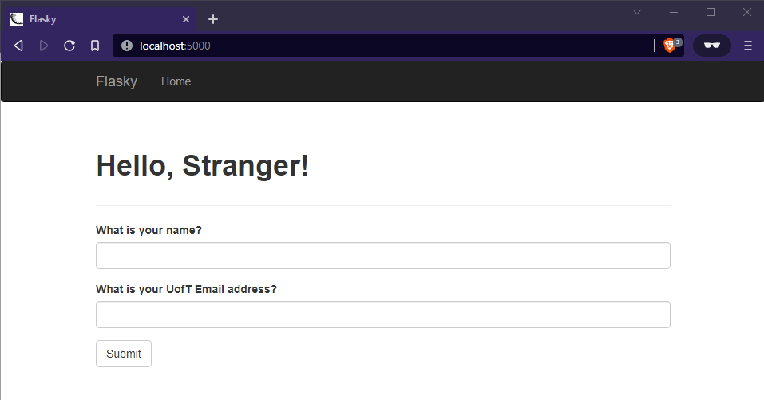

# ECE444-F2022-Lab2
Gary Wei

This repo is a clone of https://github.com/miguelgrinberg/flasky

Note: I only realized the index.html h1 text should be bold after finishing activity 3, which is why it isn't bold in 3 but then bolded in 4.

# Activity 1

# Activity 2:

# Activity 3:

# Activity 4:

